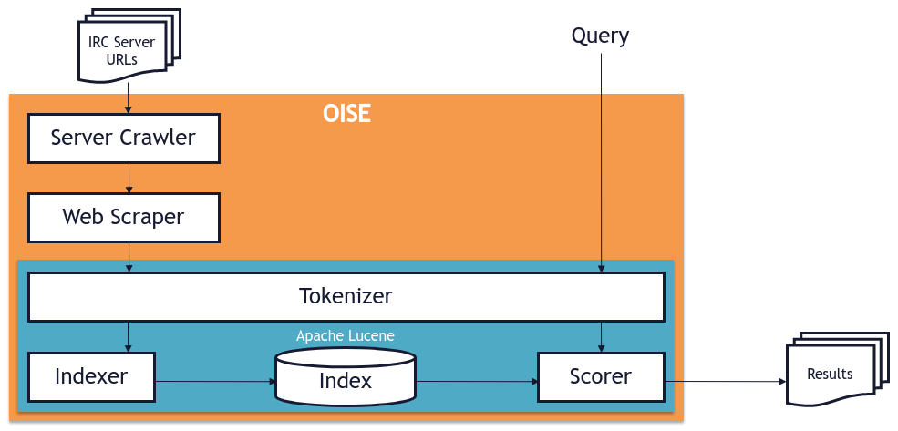

[](https://travis-ci.com/avojak/oise)


<p align="center">
  
</p>
<h1 align="center">Open IRC Search Engine (OISE)</h1>

<p align="center">OISE is an open-source search engine for IRC servers and channels.</p>

## Building

```bash
$ mvn install dockerfile:build
```

## Running

```bash
$ docker run -it --name oise -p 8080:8080 avojak/oise:latest
```

It takes a very long time for a new index to be created, so it is recommended to mount a volume to persist the index.
This will allow you to restart the container and have immediate access to the previous index while the new one is being
created.

```bash
$ docker run \
    -it \
    --name oise \
    -v lucene-index:/lucene-index \
    -p 8080:8080 \
    avojak/oise:latest
```

If you would like to customize the list of servers that are indexed, you can mount your own server list.

For example, a much shorter file (/tmp/servers.txt on your local system):
```
irc.freenode.net
irc.bsdunix.us
```

```bash
$ docker run \
    -it \
    --name oise \
    -v lucene-index:/lucene-index \
    -v /tmp/servers.txt:/servers.txt \
    -p 8080:8080 \
    avojak/oise:latest
```

## Usage

### REST API

Once running, the API documentation is viewable at [http://localhost:8080/swagger-ui.html](http://localhost:8080/swagger-ui.html).

#### Example Request

```bash
curl -X GET http://localhost:8080/api/v1/search?q=uiuc
```

### Webpage Search

A webpage for UI-based search is also available at http://localhost:8080. Simply type your query in the search field and hit <kbd>Enter</kbd>, or select the "Search" button.

## Implementation Details



OISE is implemented with Spring Boot as the application framework, and each key component of the application (crawling IRC servers, indexing channels, and searching the index) is implemented as a Guava service.

### Services

#### Crawling Service


#### Indexing Service

#### Search Service

### Configuration

<hr>

<small>OISE was developed to satisfy the Final Project requirement for [CS410: Text Information Systems](https://cs.illinois.edu/courses/profile/CS410) at the [University of Illinois at Urbana-Champaign](https://cs.illinois.edu/)</small>